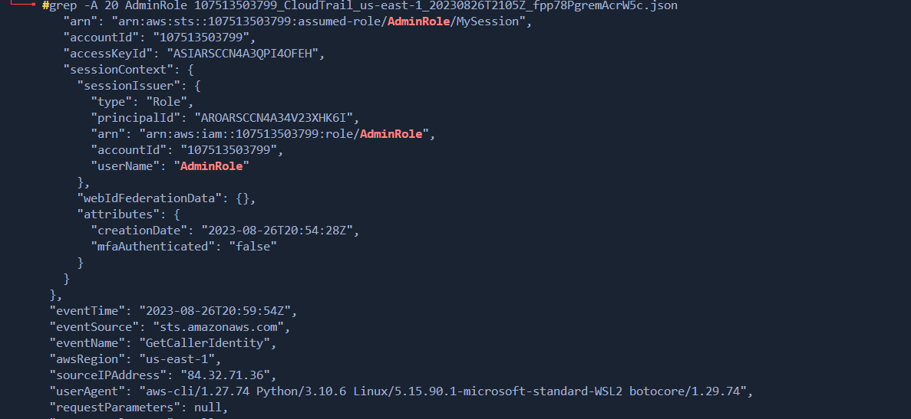

## PWNED LABS
https://pwnedlabs.io/

# Breach In the Cloud
https://pwnedlabs.io/labs/breach-in-the-cloud

# Secenario
We've been alerted to a potential security incident. The Huge Logistics security team have provided you with AWS keys of an account that saw unusual activity, as well as AWS CloudTrail logs around the time of the activity. We need your expertise to confirm the breach by analyzing our CloudTrail logs, identifying the compromised AWS service and any data that was exfiltrated.

# Team
Blue

# Difficulty
Beginner

# Real World
Analyzing AWS CloudTrail logs is a standard practice for detecting suspicious activity within an AWS account, while S3 buckets are frequently targeted by attackers due to the valuable data they can contain.

# Walkthrough
To start off with the case files are on the Pwned Labs discord. If you arent getting the files then please head over and just have a read and join the communty. 

<bash> wget https://discord.com/channels/1053648858967703652/1145109454346522654/1146038521212194856 <bash>

While that is downloading, accessing the AWS CLI with the provided credentials will give you an idea of what this account can do. It's as simple as running the command below. The assumption is that the default region is set to us-east-1, and the output format is set to JSON.

<bash>aws configure</bash>

A copy of the lab files in the module dir

Lets also check that unzip is installed 

<bash>which unzip</bash>

Lets get these files unziped and placed in a dir

Having to look at each of these files one by one might be a massive waste of time and could cause us to lose something. There are a few ways we could iterate through these files, using find and xargs.

<bash>find . -maxdepth 1 -name '*.json' -print0 | xargs -0 -n1 sh -c 'jq . "$0" | sponge "$0"'</bash>

Looking at the file is much easier now 

Lets sort thought all these files and see if we can find anything useful. Looking for keywords like "userName" and then carry on.

<bash>grep -r userName . | sort -u</bash>

./107513503799_CloudTrail_us-east-1_20230826T2035Z_PjmwM7E4hZ6897Aq.json:        "userName": "temp-user"
./107513503799_CloudTrail_us-east-1_20230826T2040Z_UkDeakooXR09uCBm.json:        "userName": "temp-user"
./107513503799_CloudTrail_us-east-1_20230826T2050Z_iUtQqYPskB20yZqT.json:        "userName": "temp-user"
./107513503799_CloudTrail_us-east-1_20230826T2055Z_W0F5uypAbGttUgSn.json:        "userName": "temp-user"
./107513503799_CloudTrail_us-east-1_20230826T2100Z_APB7fBUnHmiWjHtg.json:        "userName": "temp-user"
./107513503799_CloudTrail_us-east-1_20230826T2105Z_fpp78PgremAcrW5c.json:            "userName": "AdminRole"
./107513503799_CloudTrail_us-east-1_20230826T2105Z_fpp78PgremAcrW5c.json:        "userName": "_devansh"
./107513503799_CloudTrail_us-east-1_20230826T2105Z_fpp78PgremAcrW5c.json:        "userName": "ian"
./107513503799_CloudTrail_us-east-1_20230826T2105Z_fpp78PgremAcrW5c.json:        "userName": "policyuser"
./107513503799_CloudTrail_us-east-1_20230826T2105Z_fpp78PgremAcrW5c.json:        "userName": "temp-user"
./107513503799_CloudTrail_us-east-1_20230826T2120Z_UCUhsJa0zoFY3ZO0.json:            "userName": "AdminRole"

Looking at the output, it doesn't seem right. The temp-user doesn't follow the same convention as the other users. The CloudTrail logs also reveal something interesting: the account ran sts get-caller-identity, but even more telling is where it was invoked from—an IP address.

Lets poke it

<bash>curl ipinfo.io/84.32.71.19</bash>

Does this tell us that the infraction has come from this org. At this point it would be worth making a note to see if the client has any interactions with the company the IP belongs to.

Let’s switch to the next file:

107513503799_CloudTrail_us-east-1_20230826T2040Z_UkDeakooXR09uCBm.json

This CloudTrail log shows that the account attempted to access an S3 bucket and was denied access to an object. Let’s take a look at the next file.

The outputs are very noisy. Looking at the specific log in question, we can see there are 450 errorMessages. This could indicate a brute-force attack on IAM permissions using tools like Pacu.

Let’s move on to the next file and see what’s been logged. Ah, interesting—this file shows the actions performed by the temporary user account.

Now, looking at the second-to-last file, we can see that the temp-user invoked the sts get-caller-identity command. The assumption is that the temp-user was verifying their context.

On the last file it looks like the temp-user has switched back interest onto that s3 bucket mentioned above.

Now we have an idea of what the bad user has done lets recreate and follow the trail. 

Following the trail it doesnt look good. Follow the steps taken and what the outcome is

There is a policy attached to this role called test-temp-user, and after checking it, we can see that it allows the assumption of the AdminRole!

The role is now assumed. Lets run aws configure with the provided creds and then set the session token.

And thats how it was done. The contect of the bucket have been exposed and the attacker has gained access.

